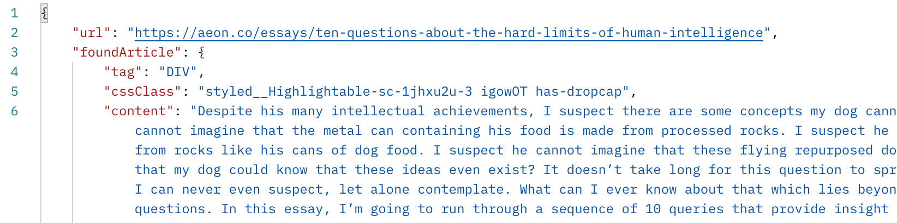

# Art Thief

Crawl and retrieve details about key content from a page.


## Uses

Useful for:
- search indexes
- catalogues
- providing content-based links in RSS readers etc.
- combine with ML for creating noun-to-content and topic-to-content indexes to surface content of real relevance
- correlate findings and link to original content of associated concepts
- readability-style extension (legally dubious when used on ad-supported pages)
    - but why? - ugly sites are not worth reading


## Features
- [x] Extract information about articles
- [] Extract primary cover or media from page
- [] Extract product information


## Example


*Source Content*


*Content Details*


## Is this really for thieves or about stealing?

No. This is for extracting content for processing so you can index it in a search tool, catalogue, or linked topics in a basic RSS reader. Depending how you use it the use will be considered either legal or illegal, as with most things. For example, in most places it's legal to spit in private but not on the streets. Do be cautious as some organizations attempt to set new legal precedence. There have been cases where prominent search engines have been challenged over sharing links to news article with their full titles, because allegedly the article's value is in the title. Personally the technical struggle is really "how can I avoid crawling illegal content?" - when the inputs are not in my control.


## Is this better than the other content scrapers?

Yes it is. The other scrapers/readability tools don't get the whole article when the paragraphs are split into sections.


## Limitations

The tool cannot extract the body of "premium" articles as you would find on many websites that require sign in and payment. You could fork it for private use theoretically and make it sign in with your own credentials.


## When Building

You want to specify the platform.

```cli
docker build --platform linux/amd64 -t art-thief .
```


## Lambda Configuration

- Memory: 2560 MB
- Timeout: 50s


## Lambda Usage

Just pass in the URL of the site. The URL must include the protocol and match an existing page, as in `"https://www.wikipedia.org"` VS `"wikipedia.org"`.

In an API request body
```json
{ "url": "url-of-page-to-crawl" }
```

In another event
```json
{ "body": {"url": "url-of-page-to-crawl" } }
```


## Low-fidelity Local Testing

Outside the container.

```cli
yarn build && node ./dist/test.js
```


## What are the key details returned?

Look at the code within `./src/interfaces`.

